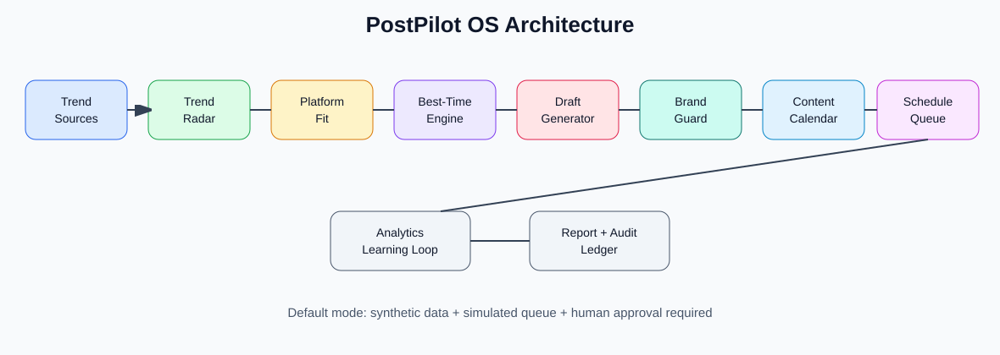

# PostPilot OS: AI Social Media Intelligence and Scheduling Operating System

<p align="center"><strong>Independent research-grade AI social media intelligence and scheduling operating system for trend discovery, content planning, best-time posting recommendations, brand-safety review, campaign calendars, simulated post queues, and synthetic analytics.</strong></p>

<p align="center">
  <a href="../../actions/workflows/python-checks.yml"></a>
  <a href="LICENSE"></a>
  
  
</p>

> **Ethical marketing boundary:** this repository uses fictional synthetic trends, audience segments, campaign briefs, content drafts, schedules, and analytics by default. It is planning and research infrastructure only. It does not scrape private personal data, post to real social platforms, create fake engagement, send spam, impersonate people, generate fake reviews, bypass platform rules, or target vulnerable people. Human approval is required before any real posting adapter is connected.

---

## Research objective

Can an AI social media intelligence operating system search or simulate public trend signals, decide where and when content should be posted, generate human-reviewed drafts, build one cross-platform schedule, and learn from analytics without unethical automation or private-data tracking?

| Research question | Evidence generated locally |
| --- | --- |
| What should we post about? | Trend radar and opportunity scores |
| Where should each topic be posted? | Platform-fit recommendation table |
| When should each post go live? | Best-time recommendation table with confidence and backup time |
| Can draft content be prepared safely? | Content drafts plus brand-safety review |
| Can all platforms be managed in one place? | Unified content calendar and simulated schedule queue |
| What worked best? | Synthetic engagement analytics and A/B test simulator |
| Can runs be audited? | JSON summary and hash-chained audit ledger |

---

## Architecture

```mermaid
flowchart LR
  A[Synthetic or public-data-ready trend sources] --> B[Trend Radar]
  B --> C[Platform Fit Engine]
  C --> D[Best-Time Recommendation]
  D --> E[Content Draft Generator]
  E --> F[Brand-Safety Guard]
  F --> G[Unified Content Calendar]
  G --> H[Schedule Queue Simulator]
  H --> I[Analytics and Experiment Loop]
  I --> J[Reports, Figures, Audit Ledger]
```

<p align="center"></p>



---

## Run today — no real platform credentials needed

```bash
python scripts/run_synthetic_postpilot_lab.py
```

Windows quick start:

```bat
cd %USERPROFILE%\ai-social-media-intelligence-scheduler-os
git pull

py -m venv .venv
.venv\Scripts\activate

python -m pip install --upgrade pip
python -m pip install -r requirements.txt
python scripts/run_synthetic_postpilot_lab.py
```

Optional larger run:

```bash
python scripts/run_synthetic_postpilot_lab.py --topics 80 --segments 12 --campaigns 10 --days 30 --seed 42
```

Run tests:

```bash
python -m pytest -q
```

---

## Generated local outputs

```text
outputs/results/synthetic_trend_signals.csv
outputs/results/synthetic_audience_segments.csv
outputs/results/synthetic_campaigns.csv
outputs/results/synthetic_brand_profile.csv
outputs/results/synthetic_trend_radar.csv
outputs/results/synthetic_platform_recommendations.csv
outputs/results/synthetic_best_time_recommendations.csv
outputs/results/synthetic_content_drafts.csv
outputs/results/synthetic_brand_safety_audit.csv
outputs/results/synthetic_content_calendar.csv
outputs/results/synthetic_schedule_queue.csv
outputs/results/synthetic_performance_analytics.csv
outputs/results/synthetic_ab_test_results.csv
outputs/results/synthetic_postpilot_summary.json
outputs/reports/synthetic_social_media_strategy_report.md
outputs/audit/postpilot_audit_log.jsonl

outputs/figures/trend_opportunity_scores.png
outputs/figures/platform_fit_scores.png
outputs/figures/best_posting_times.png
outputs/figures/content_calendar_density.png
outputs/figures/brand_safety_risk.png
outputs/figures/engagement_forecast.png
```

---

## OS-style modules

| Module | Purpose |
| --- | --- |
| `kernel.py` | Central orchestration layer that runs trend discovery to schedule queue |
| `synthetic.py` | Builds fictional trends, audience segments, campaign briefs, brand rules, and priors |
| `radar.py` | Scores content opportunities from trend growth, urgency, evergreen value, and saturation |
| `platform.py` | Recommends LinkedIn, Instagram, TikTok, YouTube Shorts, X, Facebook, Blog, or Newsletter |
| `timing.py` | Recommends best posting date/time, confidence score, and backup time |
| `content.py` | Generates platform-aware content drafts for human review |
| `brand_guard.py` | Blocks unsafe claims, spam-like wording, fake engagement language, and missing review disclaimers |
| `calendar.py` | Builds one cross-platform content calendar |
| `scheduler.py` | Simulates a post queue; real adapters are disabled by default |
| `analytics.py` | Simulates impressions, clicks, engagement, CTR, and learning signals |
| `experiments.py` | Simulates A/B tests for hooks, CTAs, formats, and times |
| `audit.py` | Maintains a hash-chained audit ledger |

---

## What makes this different

PostPilot OS is designed like an operating system for marketing operations:

```text
Trend sources are inputs.
Platforms are capability targets.
Drafts are reviewable jobs.
Brand-safety checks are policy gates.
Calendar items are scheduled tasks.
Analytics are feedback signals.
The audit log is the system journal.
```

The default pipeline is **simulation only**. Later adapters can be added for RSS feeds, public trend APIs, Google Calendar export, CSV export, Notion, or approved social-platform APIs, but only after explicit credential handling and human approval gates.

---

## Responsible automation boundary

This project supports content planning, scheduling research, and ethical marketing operations. It should never be used for spam, fake engagement, impersonation, fake reviews, deception, political persuasion targeting, scraping private personal data, exploiting vulnerable audiences, or bypassing platform limits.

Real posting requires human approval, platform API compliance, consent-aware data handling, brand/legal review where needed, and transparent uncertainty around all recommendations.

---

## Repository map

```text
src/postpilot/
  kernel.py          # central OS orchestrator
  synthetic.py       # fictional trends, audiences, campaigns, priors
  radar.py           # trend opportunity scoring
  platform.py        # where-to-post recommendation engine
  timing.py          # when-to-post recommendation engine
  content.py         # content draft generation
  brand_guard.py     # ethical marketing and brand-safety gates
  calendar.py        # cross-platform content calendar
  scheduler.py       # simulated schedule queue
  analytics.py       # synthetic performance analytics
  experiments.py     # A/B test simulator
  audit.py           # hash-chained audit ledger
  visualization.py   # local figures
  reporting.py       # Markdown strategy report
scripts/
  run_synthetic_postpilot_lab.py
docs/
  methodology.md
  ethical_marketing_boundary.md
  scheduler_design.md
  platform_adapter_plan.md
  report_template.md
tests/
  test_synthetic.py
  test_postpilot_modules.py
  test_pipeline.py
  test_audit.py
```

---

## Limitations

- Synthetic data validates the workflow but does not prove real-world campaign performance.
- Best-time recommendations are planning prompts, not guaranteed growth claims.
- No real posting is performed by the default pipeline.
- Real adapters require API compliance, human approval, rate-limit handling, and credential security.
