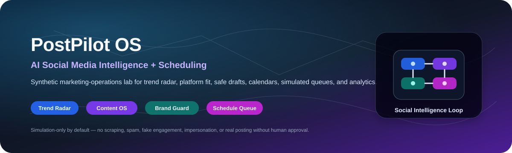
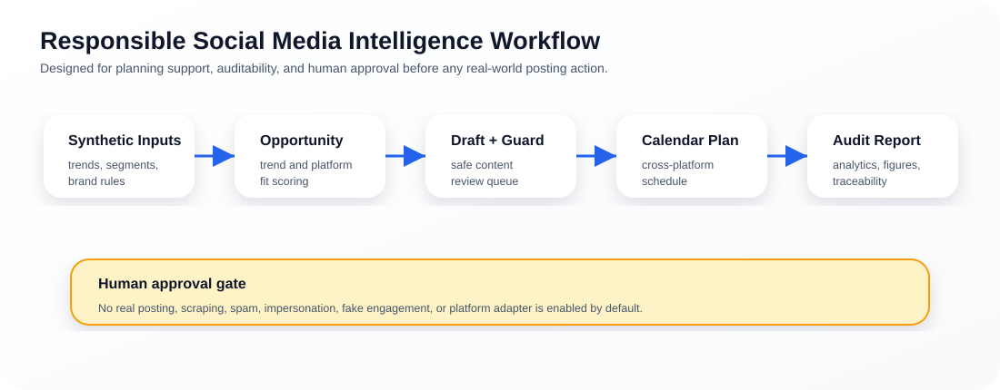

<p align="center">
  
</p>

<h1 align="center">PostPilot OS</h1>

<p align="center">
  <b>A research-grade AI social-media intelligence and scheduling operating system for trend discovery, platform-fit scoring, content planning, brand-safety review, simulated post queues, and synthetic analytics.</b>
</p>

<p align="center">
  <a href="../../actions/workflows/python-checks.yml"></a>
  
  
  
  
</p>

---

## Overview

**PostPilot OS** is an independent academic research prototype for studying how AI-assisted content operations can support ethical social-media planning without uncontrolled automation. It uses fictional synthetic trends, audience segments, campaign briefs, brand rules, draft posts, content calendars, simulated queues, and analytics to test the full workflow safely.

The project is designed around one careful research question: **can an AI social-media operating system discover content opportunities, recommend channels and timing, prepare safe drafts, and learn from analytics while preserving human approval and auditability?**

It is useful for research and teaching in:

- AI-assisted content planning.
- Social-media intelligence and trend radar design.
- Cross-platform scheduling systems.
- Brand-safety and claim-safety review.
- Simulated marketing analytics and A/B testing.
- Human-in-the-loop automation.
- Ethical marketing governance and audit trails.

> **Ethical marketing boundary:** this repository is simulation-only by default. It does not scrape private personal data, post to real platforms, create fake engagement, send spam, impersonate people, generate fake reviews, bypass platform rules, or target vulnerable audiences.

---

## Research objective

Can an AI social-media intelligence OS transform trend signals into a human-reviewed, cross-platform content schedule while keeping brand safety, platform compliance, and auditability visible?

| Research question | Evidence generated locally |
|---|---|
| What should we post about? | Trend radar and opportunity scores |
| Where should each idea be posted? | Platform-fit recommendation table |
| When should each post go live? | Best-time recommendation table with confidence and backup time |
| Can draft content be prepared safely? | Content drafts plus brand-safety review |
| Can campaigns be coordinated in one place? | Unified content calendar and simulated queue |
| What worked best in simulation? | Synthetic analytics and A/B test results |
| Can runs be audited? | CSV outputs, Markdown report, JSON summary, and hash-chained audit ledger |

---

## Architecture

```mermaid
flowchart LR
  A[Synthetic trend signals] --> B[Trend radar]
  B --> C[Platform-fit engine]
  C --> D[Best-time recommendation]
  D --> E[Draft generation]
  E --> F[Brand-safety guard]
  F --> G[Content calendar]
  G --> H[Simulated schedule queue]
  H --> I[Analytics and A/B test loop]
  I --> J[Reports and audit ledger]
```

<p align="center">
  
</p>



<p align="center">
  
</p>

The workflow is intentionally transparent. Real platform posting is not enabled by default; every draft and schedule item is treated as a reviewable planning artifact.

---

## Core capabilities

| Capability | What it does | Why it matters |
|---|---|---|
| Synthetic trend generation | Creates fictional trends, campaign briefs, audience segments, and brand rules | Enables safe experiments without real user data |
| Trend radar | Scores ideas by growth, urgency, evergreen value, and saturation | Helps identify content opportunities |
| Platform-fit engine | Recommends LinkedIn, Instagram, TikTok, YouTube Shorts, X, Facebook, Blog, or Newsletter | Supports channel-specific planning |
| Timing engine | Suggests best posting time, backup time, and confidence | Makes scheduling assumptions explicit |
| Draft generator | Produces platform-aware draft content for human review | Speeds up planning without direct posting |
| Brand-safety guard | Flags spam-like wording, unsafe claims, fake engagement language, and missing disclaimers | Reduces risky automation behavior |
| Calendar builder | Creates a cross-platform content calendar | Keeps campaigns coordinated |
| Queue simulator | Simulates scheduled posts without connecting to real accounts | Preserves safety during research |
| Analytics loop | Simulates impressions, clicks, engagement, CTR, and A/B test outcomes | Supports reproducible strategy experiments |
| Audit ledger | Writes a hash-chained event log | Makes the workflow inspectable |

---

## Run today — no real platform credentials needed

Install dependencies:

```bash
python -m pip install -r requirements.txt
```

Run the synthetic PostPilot lab:

```bash
python scripts/run_synthetic_postpilot_lab.py
```

Optional larger run:

```bash
python scripts/run_synthetic_postpilot_lab.py --topics 80 --segments 12 --campaigns 10 --days 30 --seed 42
```

Windows quick start:

```bat
cd %USERPROFILE%\ai-social-media-intelligence-scheduler-os
git pull

py -m venv .venv
.venv\Scripts\activate

python -m pip install --upgrade pip
python -m pip install -r requirements.txt
python scripts\run_synthetic_postpilot_lab.py --topics 80 --segments 12 --campaigns 10 --days 30 --seed 42
```

Run tests:

```bash
python -m pytest -q
```

---

## Generated local outputs

```text
outputs/results/synthetic_trend_signals.csv
outputs/results/synthetic_audience_segments.csv
outputs/results/synthetic_campaigns.csv
outputs/results/synthetic_brand_profile.csv
outputs/results/synthetic_trend_radar.csv
outputs/results/synthetic_platform_recommendations.csv
outputs/results/synthetic_best_time_recommendations.csv
outputs/results/synthetic_content_drafts.csv
outputs/results/synthetic_brand_safety_audit.csv
outputs/results/synthetic_content_calendar.csv
outputs/results/synthetic_schedule_queue.csv
outputs/results/synthetic_performance_analytics.csv
outputs/results/synthetic_ab_test_results.csv
outputs/results/synthetic_postpilot_summary.json
outputs/reports/synthetic_social_media_strategy_report.md
outputs/audit/postpilot_audit_log.jsonl

outputs/figures/trend_opportunity_scores.png
outputs/figures/platform_fit_scores.png
outputs/figures/best_posting_times.png
outputs/figures/content_calendar_density.png
outputs/figures/brand_safety_risk.png
outputs/figures/engagement_forecast.png
```

---

## OS-style modules

| Module | Purpose |
|---|---|
| `kernel.py` | Central orchestration layer from trend discovery to simulated queue |
| `synthetic.py` | Builds fictional trends, audience segments, campaign briefs, brand rules, and priors |
| `radar.py` | Scores content opportunities from trend growth, urgency, evergreen value, and saturation |
| `platform.py` | Recommends the best platform/channel for each topic |
| `timing.py` | Recommends posting date/time, backup time, and confidence score |
| `content.py` | Generates platform-aware drafts for human review |
| `brand_guard.py` | Blocks unsafe claims, spam-like wording, fake engagement language, and missing disclaimers |
| `calendar.py` | Builds one cross-platform content calendar |
| `scheduler.py` | Simulates a post queue; real adapters are disabled by default |
| `analytics.py` | Simulates impressions, clicks, engagement, CTR, and learning signals |
| `experiments.py` | Simulates A/B tests for hooks, CTAs, formats, and times |
| `audit.py` | Maintains a hash-chained audit ledger |

---

## What makes this different

PostPilot OS is designed like an operating system for ethical marketing operations:

```text
Trend sources are inputs.
Platforms are capability targets.
Drafts are reviewable jobs.
Brand-safety checks are policy gates.
Calendar items are scheduled tasks.
Analytics are feedback signals.
The audit log is the system journal.
```

This makes the system useful as a research prototype, teaching artifact, and extension-ready planning scaffold.

---

## Responsible automation boundary

This project supports content planning, scheduling research, and ethical marketing operations. It should never be used for spam, fake engagement, impersonation, fake reviews, deception, political persuasion targeting, scraping private personal data, exploiting vulnerable audiences, or bypassing platform limits.

Real posting requires human approval, platform API compliance, consent-aware data handling, rate-limit handling, credential security, brand/legal review where needed, and transparent uncertainty around all recommendations.

---

## Repository map

```text
.
├── assets/
│   ├── banner.svg
│   ├── postpilot_os_architecture.svg
│   └── postpilot-workflow.svg
├── docs/
│   ├── ethical-marketing-boundary.md
│   ├── reproducibility-playbook.md
│   └── publication-readiness-plan.md
├── src/postpilot/
│   ├── kernel.py
│   ├── synthetic.py
│   ├── radar.py
│   ├── platform.py
│   ├── timing.py
│   ├── content.py
│   ├── brand_guard.py
│   ├── calendar.py
│   ├── scheduler.py
│   ├── analytics.py
│   ├── experiments.py
│   └── audit.py
├── scripts/
│   └── run_synthetic_postpilot_lab.py
├── outputs/                       # generated locally, not committed by default
├── requirements.txt
├── LICENSE
└── README.md
```

---

## Documentation

- [`docs/ethical-marketing-boundary.md`](docs/ethical-marketing-boundary.md): simulation-only policy, human approval gate, and non-intended uses.
- [`docs/reproducibility-playbook.md`](docs/reproducibility-playbook.md): run records, evidence bundles, and interpretation rules.
- [`docs/publication-readiness-plan.md`](docs/publication-readiness-plan.md): research framing and future paper-extension ideas.

---

## Future extensions

| Extension | Requirement before claiming results |
|---|---|
| RSS/public trend input | Source attribution, rate limits, and public-data boundary |
| Real platform adapter | Human approval, API compliance, credential security, and rollback plan |
| Calendar export | User confirmation and clear status labels |
| Notion or spreadsheet export | Data-minimization and permissions review |
| Real analytics import | Privacy-preserving aggregation and platform-policy compliance |
| Brand policy engine | Explicit policy versioning and review logs |

---

## Limitations

- Synthetic data validates the workflow, not real campaign performance.
- Best-time recommendations are planning prompts, not guaranteed growth claims.
- No real posting is performed by the default pipeline.
- Real adapters require API compliance, human approval, rate-limit handling, credential security, and auditability.
- Brand-safety flags are review aids, not legal or platform-policy certification.

## License

Released under the [MIT License](LICENSE). Synthetic examples are provided for research and education only.
